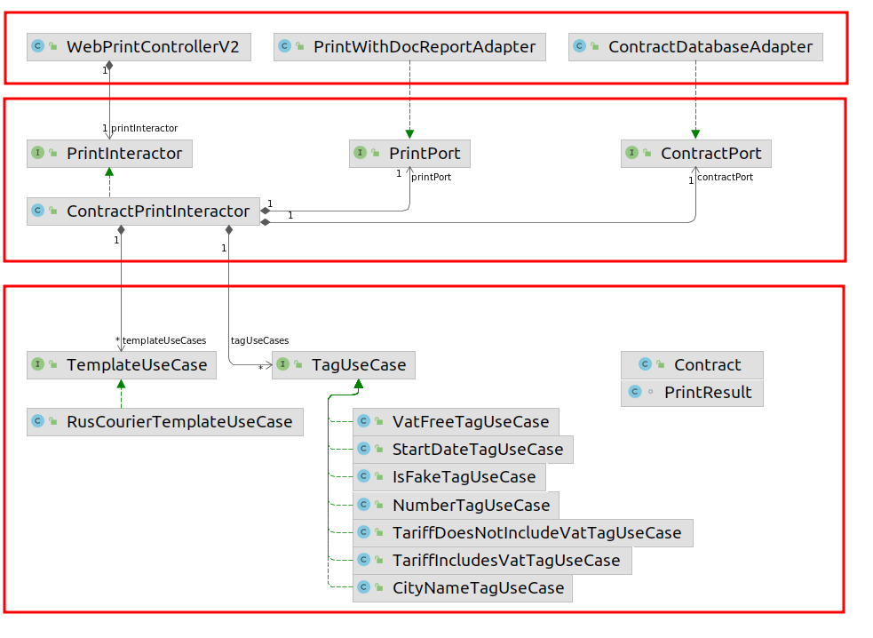

= Печать. Рефакторинг от транспортов к тэгам 10.2022

== Введение

Изначально механизм печати был спроектирован таким образом, что обеспечивал печать одного шаблона.
Поэтому логичным решением было создание транспортного объекта TemplateDto,
полями которого являлись тэги, которые заполнялись значениями из договора и при печати заполняли форму.
Однако, сервис договор развивался и начали добавляться новые печатные формы.
Поскольку тэги печатных форм по большей части совпадали, то транспортный объект остался основной концепцией,
периодически расширяясь с добавлением новых тэгов.
В результате, сейчас в договоре 13 печатных форм и есть перспектива дальнейшего увеличения их числа.
При этом, транспортный объект агрегирует все существующие тэги, а логика их заполнения довольно размазанная,
что приводит к тому, что при добавлении новых печатных форм модифицируются десятки классов.
Предлагается провести рефакторинг таким образом, чтобы отказаться от транспортного объекта в пользу
динамически изменяемого набора тэгов.
Также, заполнение этих тэгов должно происходить максимально независимо, для того чтобы изменения
в работе с одной печатной формой не приводили к изменениям в работе с другой формой.
Иными словами, нужно обеспечить единство ответственности, расширяемость.

== PrintController

[plantuml]
----
@startuml

actor User
participant PrintController
participant PrintTemplatesRegisterService
participant TemplateService

User -> PrintController: Получить печатную версию договора
PrintController -> PrintTemplatesRegisterService: are templates loaded to DocReport?
PrintTemplatesRegisterService -> PrintController: true/false. If false, exception
PrintController -> TemplateService: id, lang, format
TemplateService -> PrintController: linkToFile, name
PrintController -> User: DocumentBase64Dto
@enduml
----

Контроллер сам проверяет готовы ли шаблоны, и бросает валидационные исключения. Вероятно это не его ответственность

== TemplateService

[plantuml]
----
@startuml

participant TemplateService
participant ContractDao
participant ContractFiller
participant PrintTemplateResolverV2
participant PrintTemplateFiles
participant CounterpartyService
participant templateConverterMap
participant TemplateConverter
participant TemplateDtoToMapConverter
participant ExternalPrintServiceConnector

TemplateService -> ContractDao: get(id)
TemplateService <- ContractDao: contract
TemplateService -> ContractFiller: fillContractToTemplate(contract)
TemplateService -> PrintTemplateResolverV2: resolve(contract)
TemplateService <- PrintTemplateResolverV2: PrintTemplateConverterNames[enum]
TemplateService -> PrintTemplateFiles: getFileNameByTemplate(%s.%s, PrintTemplateConverterNames.code, contract.type)
TemplateService <- PrintTemplateFiles: templateFileName
TemplateService -> CounterpartyService: getByContract(contract)
TemplateService <- CounterpartyService: counterparty
TemplateService -> templateConverterMap: get(printTemplate.converterName)
TemplateService <- templateConverterMap: converter
TemplateService -> TemplateConverter: convert(contract, counterparty, lang, printTemplate)
TemplateService <- TemplateConverter: templateDto
TemplateService -> TemplateDtoToMapConverter: toMap(templateDto)
TemplateService <- TemplateDtoToMapConverter: tagsMap

TemplateService -> ExternalPrintServiceConnector: loadFromDocReportToResource(url, dto)
TemplateService <- ExternalPrintServiceConnector: resource
@enduml
----

== TemplateResolver

[plantuml]
----
@startuml
allow_mixing
rectangle PrintTemplateResolverV2 {
    usecase resolve

    class PrintTemplateConverterParameters {
        officeCountryCode
        legalEntityCountryCode
        counterpartyCountryCode
        isSelfEmployedcounterparty
        contractTypeCode
        build()
    }

    rectangle PrintTemplateResolverParametersKeeper {
        usecase getSinglePrintTemplateConverterNames
        usecase values
        usecase matchPrintTemplateConverterName
        usecase isEqualOffice
        usecase isEqualLegalEntity
        usecase isEqualCounterpartyCountry
        usecase isEqualSelfEmployedCounterparty
        usecase isEqualContractType
    }
}

resolve --> PrintTemplateConverterParameters: (2)  contract
resolve <-- PrintTemplateConverterParameters: parameters

resolve ---> getSinglePrintTemplateConverterNames: (3) parameters
resolve <--- getSinglePrintTemplateConverterNames: PrintTemplateConverterNames[enum]

getSinglePrintTemplateConverterNames --> values: foreach
getSinglePrintTemplateConverterNames <-- values: PrintTemplateResolverParametersKeeper[enum element]
getSinglePrintTemplateConverterNames -> matchPrintTemplateConverterName: (enum element, parameters)
getSinglePrintTemplateConverterNames <- matchPrintTemplateConverterName: true/false

matchPrintTemplateConverterName <--> isEqualOffice
matchPrintTemplateConverterName <--> isEqualLegalEntity
matchPrintTemplateConverterName <--> isEqualCounterpartyCountry
matchPrintTemplateConverterName <--> isEqualSelfEmployedCounterparty
matchPrintTemplateConverterName <--> isEqualContractType

@enduml
----

В коде много статических вызовов, что усложняет его тестирование.

Здесь видится оптимальным создание интерфейса и множества реализаций (13, по одной на шаблон),
при этом реализация сможет идентифицировать совпадают с ней факторы, либо нет.
По факту эта абстракция и будет шаблоном, который сможет идентифицировать подходит ли он для конкретного договора.

В этом случае можно будет ограничиться автовайрингом бинов-реализаций этого интерфейса и итерироваться по ним, до момента, пока не произойдет совпадение для шаблона.
Таким образом, мы создадим возможность расширения без необходимости внесения изменений в существующие рализации,
то есть будем соблюдать Open-close principle.

== TemplateConverter

[plantuml]
----
@startuml
'left to right direction

abstract class TemplateConverter {
    TemplateDto convert(contract, cdek, lang, printTemplate)
    void setGeneralFields(contract, cdek, dto, lang, printTemplate)
    void setBasicFieldsForAnyTemplate(contract, cdek, dto, lang, printTemplate)
    void setGeneralFieldsForInternetStore(contract, cdek, dto, lang, printTemplate)

    {wannabe abstract} setSpecificFields(contract, templateDto, lang)
    {wannabe abstract} setSpecificFieldsForInternetStore(contract, templateDto, lang)
    {wannabe abstract} setInternationalTemplateFields(contract, templateDto, lang)
}

class BasicFieldsFacade {
    void setBasicFields(contract, templateDto)
    void setBasicFieldsForInternetStore(contract, templateDto)
    void setStartDate(contract, templateDto)
    void setPenaltyRate(contract, templateDto)
    void setCityName(contract, templateDto, lang)
}

class PreambleFacade {
    void setPreamble(contract, cdek, dto, lang, templateName)
}

class ClientInfoFacade {
    void setPreamble(contract, dto, lang)
}

class ValidnessFacade {
    void setValidness(contract, dto)
}

class RefundPeriodFacade {
    void setRefundPeriod(contract, dto)
}

class CdekInfoFacade {
    void setCdekInfo(contract, cdek, dto, lang)
}

class SettlementProcedureFacade {
    void setSettlementProcedure(contract, dto)
}

class ClearingRuleFacade {
    void setClearingRule(contract, dto)
}

class ClientPhoneFacade {
    void setClientPhone(contract, dto)
}

class CdekRequisitesFacade {
    void setCdekRequisites(contract, dto)
}

class ClientRequisitesFacade {
    void setClientRequisites(contract, dto)
}

class FacadeHelper
class CityNameService
class ContractStatusMapper

class CdekProxyValueConstructor
class ClientProxyValueConstructor
class ICommonCatalogService
class ResourceLoader
class ContragentOwnershipFormDao
class RequisiteConverter

TemplateConverter o-- BasicFieldsFacade
TemplateConverter o-- PreambleFacade
TemplateConverter o-- CdekRequisitesFacade
TemplateConverter o-- ClientRequisitesFacade
TemplateConverter o-- ClientInfoFacade
TemplateConverter o-- CdekInfoFacade
TemplateConverter o-- SettlementProcedureFacade
TemplateConverter o-- ClearingRuleFacade
TemplateConverter o-- ValidnessFacade
TemplateConverter o-- RefundPeriodFacade
TemplateConverter o-- ClientPhoneFacade

BasicFieldsFacade o-- FacadeHelper
BasicFieldsFacade o-- CityNameService
BasicFieldsFacade o-- ContractStatusMapper

FacadeHelper o-- CdekProxyValueConstructor
FacadeHelper o-- ClientProxyValueConstructor
FacadeHelper o-- ICommonCatalogService
FacadeHelper o-- ResourceLoader
FacadeHelper o-- ContragentOwnershipFormDao

PreambleFacade o-- FacadeHelper
PreambleFacade o-- ReloadableResourceBundleMessageSource

ClientInfoFacade o-- FacadeHelper

CdekInfoFacade o-- FacadeHelper

SettlementProcedureFacade o-- FacadeHelper

ClearingRuleFacade o-- SettlementProcedureFacade

CdekRequisitesFacade o-- FacadeHelper
CdekRequisitesFacade o-- RequisiteConverter

ClientRequisitesFacade o-- FacadeHelper
ClientRequisitesFacade o-- RequisiteConverter
@enduml
----

Если говорить про конвертер в целом, можно выделить большое количество зависимостей,
дозаполнение сущности данными из сервисов и дао, хотя этап заполнения должен происходить до конвертации.

Как уже говорилось выше, видится целесообразным вместо конвертера ввести более атомарные компоненты,
которые будут отвечать за конкретные тэги.
Далее эти компоненты будут коллекционироваться компонентами шаблонов, заполняться и отправляться на печать.

Наконец, у TemplateConverter есть 9 реализаций, в которых переопределяются некоторые из
методов базового класса, по факту реализуя Шаблонный метод. В целом это хороший подход, но в данном случае видимо он
нам перестанет работать всвязи с отказом от транспортного объекта как контейнера тэгов.

== Альтернативная реализация

Предлагается сделать реализацию с использованием подходов архитектуры портов и адаптеров.

Доменный слой печати будет оперировать терминами тэгов и шаблонов и реализовывать их.
На уровне приложения будет находиться сервис, который будет оркестрировать взаимодействие доменных объектов между собой.
Инфраструктурный слой будет знать про конкретную реализацию, которая "печатает" наши шаблоны, будет знать имена файлов шаблонов в файловой системе.
Внутренние слои при такой реализации не будут знать о внешних, направление зависимости снаружи вовнутрь.

Где 1 - слой инфраструктуры, 2 - слой приложения 3 - слой домена

На диаграмме представлено меньше реализаций юзкейсов, чем будет в реальности.

Таким образом, контроллер из инфраструктурного слоя передаёт в сервис идентификатор договора, сервис получает заполненную сущность договора, итерируется по инжектированным в него юзкейсам шаблонов, при этом шаблон проверяет своё соответствие данному договору.
Далее, из шаблона извлекается список тэгов, которые потребуются для печати данного шаблона, по этому списку происходит фильтрация инжектированных в сервис юзкейсов тэгов и при помощи этих реализаций происходит извлечение значений из сущности договора. Затем тэги передаются в порт печати который реализован адаптером на инфраструктурном слое. Адаптер формирует обращение в DocReport, а также приводит полученный файл в base64.
